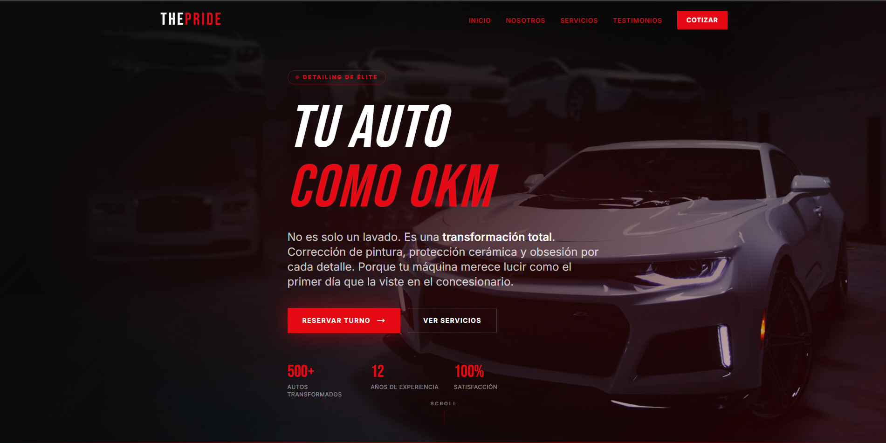
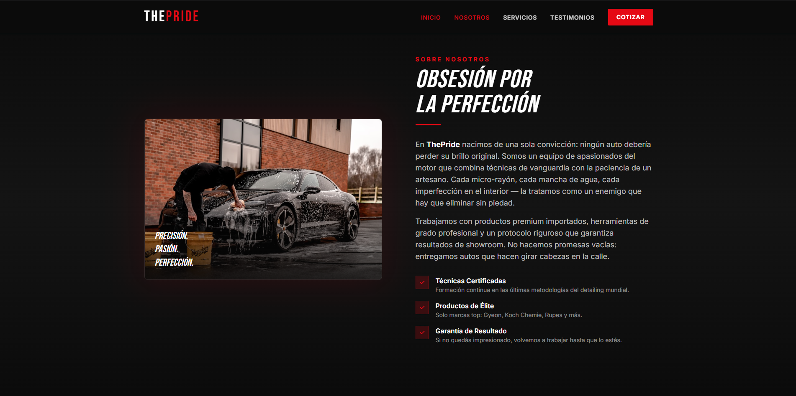
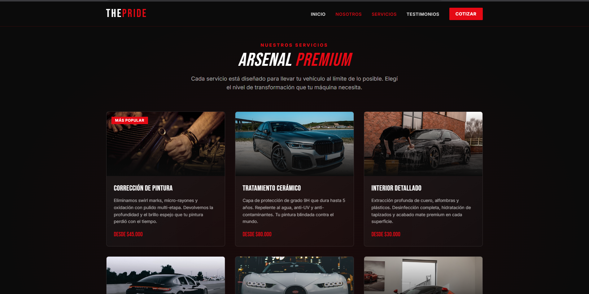
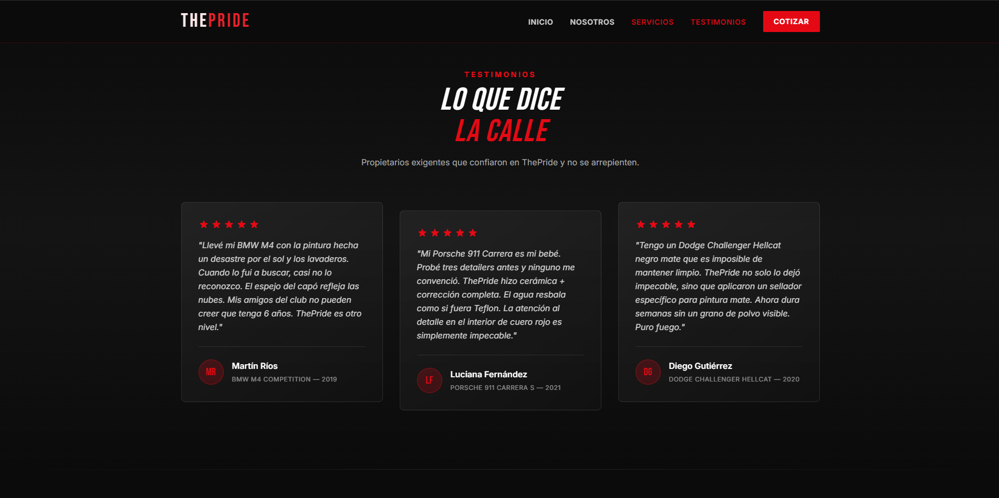
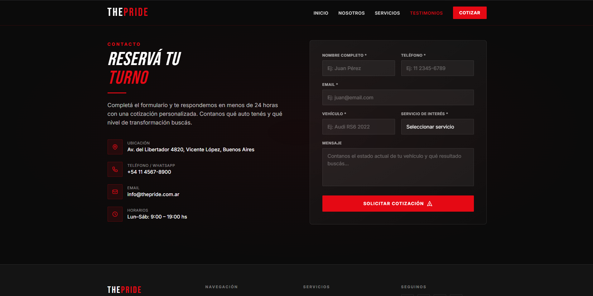
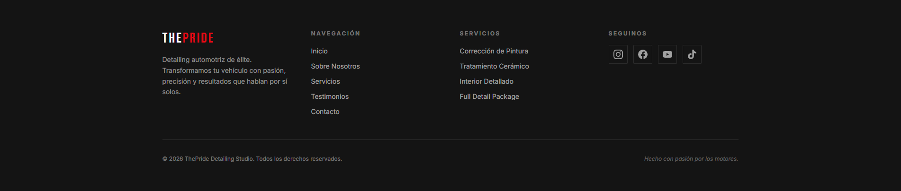
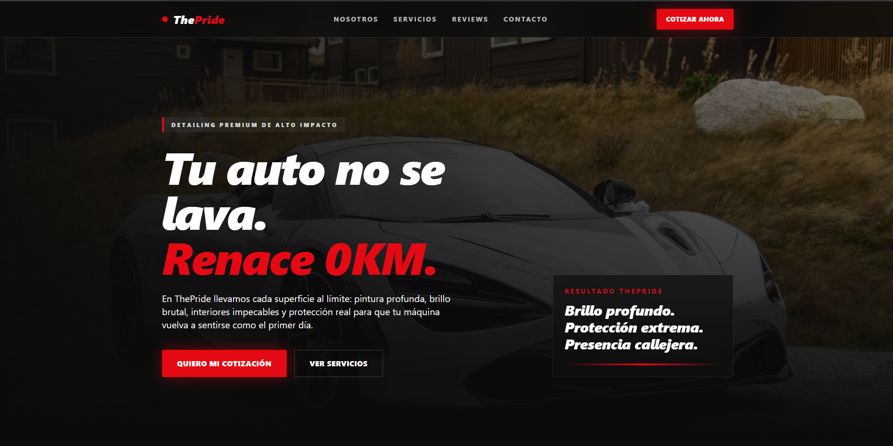
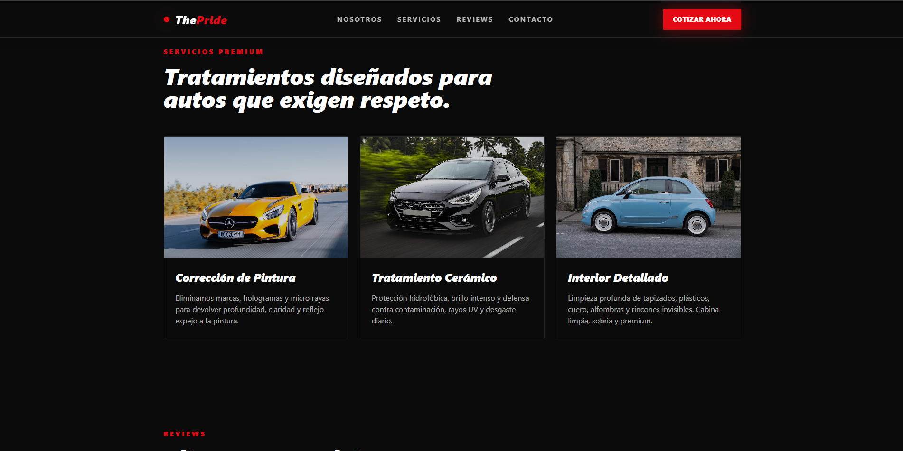
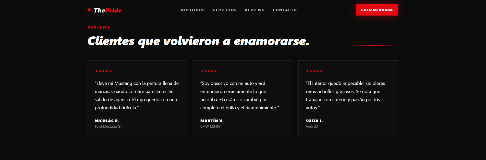
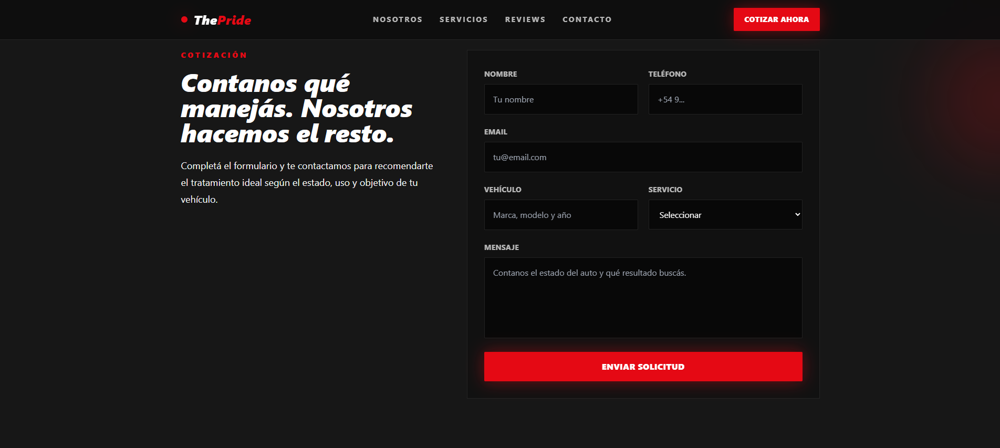

# Práctica Formativa Obligatoria 2: Prompt Engineering en Agentes de IA

## Datos del Estudiante
* **Nombre:** Enzo Giangreco
* **Institución:** IFTS N.°29
* **Materia:** Desarrollo de Sistemas Web (Front End) - 2° D
* **Fecha de Entrega:** 26/06/2026

## Despliegue Unificado
El proyecto se encuentra desplegado de forma unificada en un único enlace a través de Vercel. Al ingresar, se presentará una portada de acceso para navegar por los diferentes entregables.

https://pfoagentes.vercel.app/

## Prompt Exacto Utilizado
Para evaluar la resolución autónoma de los agentes de software, se diseñó e implementó la siguiente instrucción inicial basada en las guías oficiales de OpenAI y Anthropic:

# ROLE & CONTEXT
You are an expert Senior Front-End Developer and UI/UX Designer. Your task is to autonomously build a high-conversion, visually stunning Landing Page for a premium automotive detailing studio named "ThePride". 

# TARGET AUDIENCE & TONE
The audience consists of car enthusiasts, gearheads, and owners who demand perfection and luxury for their vehicles. The tone must be aggressive, high-energy, and premium—deeply inspired by the "Fast & Furious" movie franchise aesthetic. The core value proposition is transforming cars to make them look brand new ("Like New").

# DESIGN SYSTEM & VISUALS
- Color Palette: Dominant deep black (#0b0b0b) and dark grays, crisp white for high-contrast typography, and a furious, vibrant red (#e50914 or similar) strictly used for accents, highlights, hover states, and Call-To-Action (CTA) elements.
- Typography: Bold, italicized, or high-impact sans-serif headers that evoke speed and power, combined with highly readable body text.
- Layout: Modern, clean, and organic. Use dark gradients, subtle neon/glossy textures, and clean section dividers to ensure it feels premium, not cluttered.
- Imagery: Use high-quality placeholder images via Unsplash or similar public CDNs, strictly related to luxury sports cars, paint correction, ceramic coating, and professional detailing workshops.

# TECHNICAL RESTRICTIONS (CRITICAL)
- Technology Stack: Pure HTML5, Tailwind CSS (via official stable CDN), and Vanilla JavaScript (if needed for basic interactions).
- Code Constraints: All code must be written cleanly, modularly, and fully contained within a single `index.html` file (including Tailwind configuration via CDN or classes, inline styles if necessary, and scripts). Do not create external CSS or JS files unless strictly necessary, to ensure portability.
- Autonomy: Do not leave placeholders like "// TODO: add text here". Write fully complete, organic, and realistic copy in Spanish.

# REQUIRED LANDING PAGE STRUCTURE
The page must flow organically across these 7 mandatory sections:
1. Header: Navigation menu with a prominent logo ("ThePride"), links to sections, and a subtle accent.
2. Hero Section: A jaw-dropping, high-impact title about making cars look "0km", a gripping subtitle, an atmospheric car background image, and a highly visible Call-To-Action (CTA) button driving users to contact.
3. Description / About Us ("Sobre Nosotros"): A narrative about the passion for cars, precision, and the obsession with perfection.
4. Services / Main Features: A grid or showcase of premium services (e.g., Corrección de Pintura, Tratamiento Cerámico, Limpieza de Interiores Detallada).
5. Testimonials / Reviews: At least 3 realistic and engaging reviews from passionate car owners praising the results.
6. Contact Form: A visually striking, fully-mapped front-end contact form (no backend functionality needed) where users can request a quote.
7. Footer: Bottom navigation, copyright, and social media icon links.

# OUTPUT EXPECTED
Generate the complete, unbroken, production-ready `index.html` code. Ensure the code is beautifully indented, comments are included for each section, and no manual intervention is required to make it fully responsive (mobile-friendly).

Resultados y Capturas de Pantalla
1. Agente 1: Cursor

2. Agente 2: OpenAI Codex

## Conclusiones Técnicas y Comparativa

Luego de ejecutar el mismo prompt de alta precisión en ambos agentes de forma 100% autónoma, se observaron claras diferencias en sus capacidades de interpretación de diseño y arquitectura de software:

* **Agente 1 (Cursor):** Demostró una superioridad notable en el **manejo de la estética general** y la experiencia de usuario (UI/UX). Logró capturar a la perfección la atmósfera *premium* y agresiva inspirada en el automovilismo nocturno, aplicando de forma orgánica los contrastes en rojo furioso, la jerarquía visual en la Hero Section y una selección de imágenes muy acertada para el nicho de *detailing*. 
* **Agente 2 (OpenAI Codex):** Se destacó fuertemente en la **solidez de su estructura**. El código generado fue impecable a nivel de semántica HTML5, modularidad en los comentarios de cada sección y consistencia en el maquetado técnico del formulario y el footer.
* **Manejo de Tailwind CSS y Adaptabilidad (El diferencial):** Mientras que **Cursor** arriesgó más con layouts modernos y envolventes utilizando clases avanzadas de Tailwind que respondieron de manera fluida en dispositivos móviles, **Codex** optó por una estructura más conservadora y rígida, priorizando que no se rompiera ningún componente pero sacrificando parte del impacto visual "disruptivo" que el público entusiasta de los autos busca.